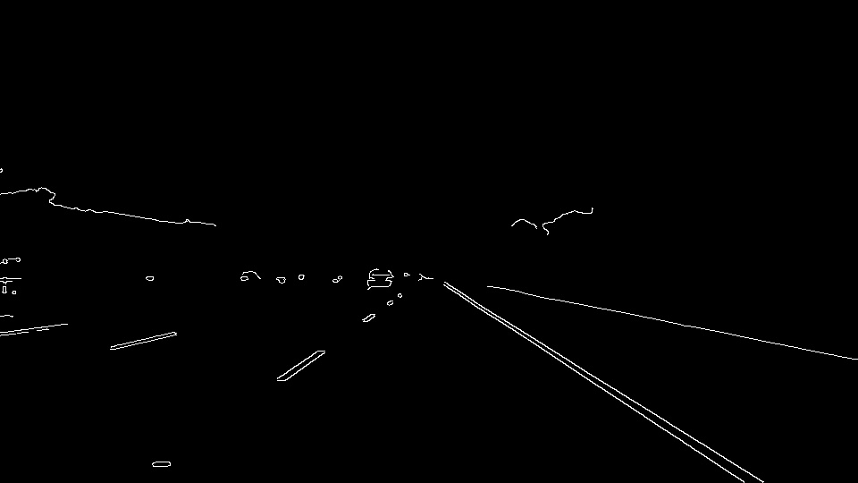
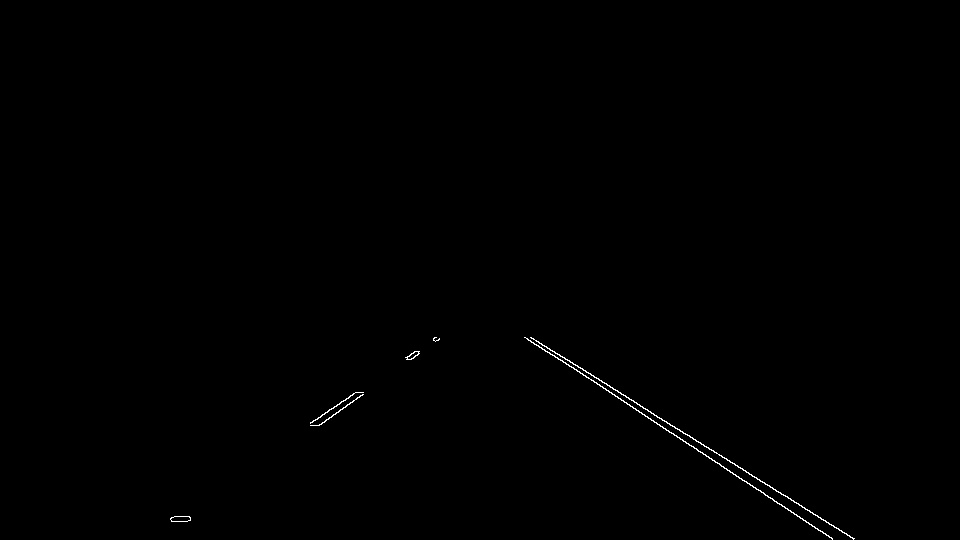
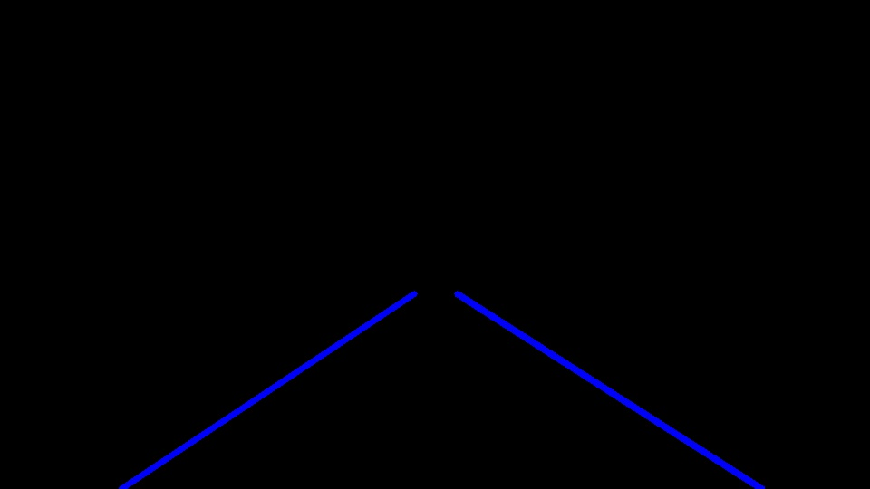
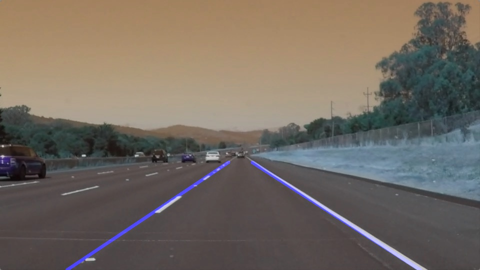

# **Finding Lane Lines on the Road** 

### Reflection

### 1. Describe your pipeline. As part of the description, explain how you modified the draw_lines() function.

My pipeline consisted of 5 steps. 

1. The original image was converted to grayscale

2. The grayscale was then smoothed using a Gaussian filter using a kernal size of 5

3. The canny edge detection algorithm is used on the grayscale image. The canny detection thresholds were set at 150 and 250 for the 
low and high thresholds respectively.

4. A region of interest was defined to mask any unwanted edges outside of my defined trapezoid shape. 

5. The Hough transform was used to find line segments within the region of interest image. The line segments were then passed to the draw_lines function.Here, the slope and intercepts were calculated for each line segment present in the ROI. It was determined that negative slopes were left lines and positive slopes were right lines. Some conditions were set for the calculated slope and intercept values to ensure only line segments clost to the actual line markers were considered. The average slope and intercepts were then calculated for the left and right line segments. These average values were used to extrapolate the line from the bottom of the image to a predetermined point approximately half the height of the image. 

6. The lines drawn from the Hough transform are now overlayed on top of the original image. 

### 2. Identify potential shortcomings with your current pipeline

One potential shortcoming would be what would happen when the line markers begin to curve sharpely. Since I am simply drawing a line based on two points in the image, it would be difficult to accurately draw lines on a sharply curved road. 

Another shortcoming would be if there are multiple potential line markers in the same image or frame. Such potential line markers could be tire skid marks, tar marks, crosswalks, double solid lane markers, and construction objects. These false positive could run parallel and very close to the actual line markings, causing them to be included within the slope and intercept average calculations. Ultimately, this would cause the lines to be drawn with a bias towards the false positive markers. 

### 3. Suggest possible improvements to your pipeline

A possible improvement would be to add a filtering function to smooth the transition between slope and intercept calculations per frame. 

Another potential improvement could be to include a nonlinear curve to draw the line markers. This would allow for better performance while detecting line markers with increasing curvatures. 

### Video Ouputs
Solid White Line Right
<video src="test_videos_output/solidWhiteRight.mp4" width="320" height="200" controls preload></video>

Solid Yellow Line Left
<video src="test_videos_output/solidYellowLeft.mp4.mp4" width="320" height="200" controls preload></video>
